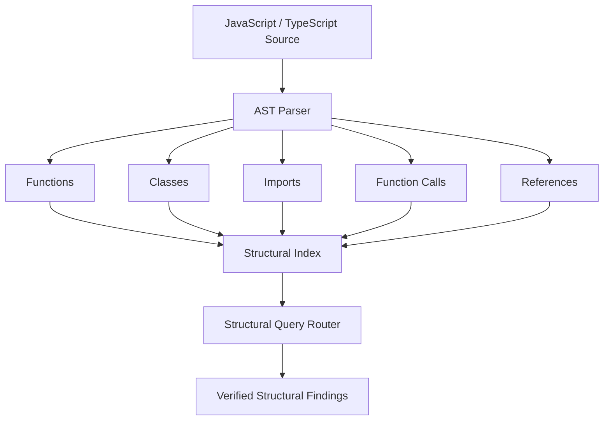

# ExynoX Code Intelligence — Architecture Specification

\> **\*\*Samsung PRISM Gen AI Hackathon 2026–27\*\***  

\> **\*\*Theme 1:\*\*** Agentic Code Intelligence  

\> **\*\*System Architecture Document\*\***

---

## 1. Architectural Principles

1\. **\*\*Bounded LLM Context Consumption\*\***: The LLM must never receive an entire codebase as raw prompt context. Exploration is performed hierarchically through indexing, AST static analysis, and targeted tool-driven inspections.

2\. **\*\*Deterministic-First Foundation\*\***: Repository ingestion, lexical retrieval, local semantic retrieval, structural analysis, and evidence verification are deterministic and can operate without an external AI API.

3\. **\*\*Verified Evidence Grounding\*\***: Answers must cite verified files, line boundaries, and code snippets rather than relying on ungrounded generative inference.

4\. **\*\*Non-Invasive Security\*\***: User API keys exist strictly in ephemeral session memory (\`sessionStorage\` per active tab) and are never persisted to disk or sent to telemetry.

---

**## 2. Ingestion Layer**

The Ingestion Layer normalizes raw repository sources into an in-memory \`RepositoryWorkspace\`.

\`\`\`

[ZIP File / GitHub URL / Sample Repo]

                   │

                   ▼

       [Archive / Source Stream]

                   │

                   ▼

┌──────────────────────────────────────────────┐

│           Security & Path Sanitizer          │

│ - Rejects path traversal (..)                │

│ - Rejects absolute / root-level paths        │

│ - Enforces size limit (50 MB)                │

│ - Enforces file count cap (500 files)        │

│ - Strips binary & cache files (.git, .pyc)   │

└──────────────────────┬───────────────────────┘

                       │

                       ▼

┌──────────────────────────────────────────────┐

│            RepositoryWorkspace               │

│ - Map\<filePath, RepositoryFile>              │

│ - Line normalization (\r\n -> \n)            │

│ - Slicing: getFileLines(path, start, end)    │

│ - Multi-language classification              │

│ - Lexical token indexing (BM25)              │

└──────────────────────────────────────────────┘

\`\`\`

### Key Components:**

\- \`zipIngestion.ts\`: Unpacks \`.zip\` archives client-side using \`jszip\`.

\- \`githubIngestion.ts\`: Clones public GitHub repository file trees and downloads source files via GitHub REST API.

\- \`sampleRepository.ts\`: Instantiates the deterministic \`samsung-prism-device-hub\` repository.

\- \`repositoryWorkspace.ts\`: Thread-safe, indexed in-memory representation supporting exact 1-based line slicing and lexical token lookups.

---

**## 3. JavaScript / TypeScript Structural Analysis Engine

The primary structural analysis path parses JavaScript and TypeScript source into an AST-oriented representation. This allows ExynoX to answer code-relationship questions that ordinary text search cannot reliably answer.



### Main implementation

- `astParser.ts`: Parses supported JavaScript and TypeScript source and extracts structural entities.
- `queryRouter.ts`: Routes structural questions to the structural index when appropriate.
- `repositoryWorkspace.ts`: Provides the repository source and exact line information used by structural analysis.

### Deterministic capabilities

- **Function definitions**: Locate exact definition boundaries.
- **Class definitions**: Locate classes and associated methods.
- **Call relationships**: Identify relevant callers and callees.
- **Imports**: Locate import relationships across supported source files.
- **References**: Resolve relevant symbol references within the indexed repository.

The structural layer is language-aware; other repository files can still participate in file discovery, lexical retrieval, semantic retrieval, and direct inspection even when a language-specific AST analyzer is not available.

---

## 4. Hybrid Retrieval Model

ExynoX combines three complementary retrieval dimensions:

1. **BM25 lexical retrieval** for exact identifiers, filenames, configuration keys, and textual matches.
2. **Local semantic retrieval** using a deterministic 128-dimensional representation for conceptually related queries.
3. **Structural AST retrieval** for functions, classes, imports, calls, references, and related symbols.

The conceptual pipeline is:

```text
                         User Query
                             │
             ┌───────────────┼───────────────┐
             ▼               ▼               ▼
        ┌──────────┐   ┌────────────┐   ┌──────────────┐
        │   BM25   │   │  Semantic  │   │ AST /        │
        │ Lexical  │   │  128-D     │   │ Structural   │
        └────┬─────┘   └─────┬──────┘   └──────┬───────┘
             │               │                 │
             └───────────────┼─────────────────┘
                             ▼
                    Candidate Ranking
                             │
                             ▼
                  Reciprocal Rank Fusion
                             │
                             ▼
                       Top-K Evidence
```

### Retrieval components

- **BM25 Lexical Matching**: Matches identifier and textual tokens against the repository index.
- **Local Semantic Scoring**: Finds conceptually related content without requiring a remote embedding API for the baseline pipeline.
- **AST Structural Boosting**: Increases relevance for candidates supported by structural analysis.
- **Count Query Handling**: Handles deterministic repository statistics without unnecessary generative reasoning.

The primary implementation is:

`src/services/retrieval/hybridRetriever.ts`

---

## 5. Agentic Planning and Verification Flow**

ExynoX uses a controlled investigation state machine. AI-assisted synthesis is optional; repository search, inspection, relationship following, and evidence verification remain deterministic.

\`\`\`

                  ┌──────────────────────┐

                  │    User Question     │

                  └──────────┬───────────┘

                             │

                             ▼

                  ┌──────────────────────┐

                  │  UNDERSTANDING &     │

                  │  PLANNING            │

                  └──────────┬───────────┘

                             │

                             ▼

                  ┌──────────────────────┐

                  │  SEARCHING           │

                  │  (Hybrid Retrieval)  │

                  └──────────┬───────────┘

                             │

                             ▼

                  ┌──────────────────────┐

                  │  INSPECTING          │

                  │  (Line Slice Sizer)  │

                  └──────────┬───────────┘

                             │

                             ▼

                  ┌──────────────────────┐

                  │  FOLLOWING           │

                  │  (Call Graph / AST)  │

                  └──────────┬───────────┘

                             │

                             ▼

               ┌────────────────────────────┐

               │    VERIFYING EVIDENCE      │

               │ Is evidence sufficient?    │

               └──────┬──────────────┬──────┘

                      │              │

             No (and  │              │ Yes (or max

             iter < 6)│              │ iterations reached)

                      ▼              ▼

           ┌────────────────┐ ┌────────────────────────┐

           │ REFINE SEARCH  │ │ GROUNDED AI SYNTHESIS  │

           │ (Next symbol)  │ │ File citations + lines │

           └───────┬────────┘ └────────────────────────┘

                   │

                   └───────► (Loop to SEARCHING)

\`\`\`

### Operational Steps:**

1\. **\*\*UNDERSTANDING\*\***: Analyzes question intent (definition, usage, pipeline flow, caller query).

2\. **\*\*PLANNING\*\***: Generates an actionable investigation plan specifying candidate files.

3\. **\*\*SEARCHING\*\***: Executes hybrid retrieval across the indexed workspace.

4\. **\*\*INSPECTING\*\***: Reads targeted line slices of candidate files (\`getFileLines\`).

5\. **\*\*FOLLOWING\*\***: Traces caller/callee references and import chains.

6\. **\*\*VERIFYING\*\***: Evaluates whether retrieved evidence answers the user's question.

7\. **\*\*GROUNDED SYNTHESIS\*\***: Produces a structured explanation citing verified files and line numbers.

---

**## 6. Repository-Agnostic Investigation

General investigation resolves symbols and concepts against the currently loaded repository instead of depending on hardcoded sample-project names.

```text
Natural-Language Question
          ↓
Symbol / Concept Detection
          ↓
Repository Structural Index
          ↓
Actual Repository Symbol
          ↓
Verified Source Evidence
```

Sample repositories remain useful for demonstrations and benchmark evaluation, but the general investigation pipeline is designed to operate across supported repositories.

---

## 6. Evaluation & Benchmarking Methodology**

ExynoX includes a reproducible evaluation engine for retrieval quality, latency, indexing cost, and evidence grounding.

### Metrics Measured:**

\- **\*\*\`Precision\@k\`\*\*** ($k \in \\{1, 3, 5\\}$): Proportion of retrieved candidate files in top-$k$ results that match the ground-truth relevant files.

  $$\text{Precision}@k = \frac{|\text{Top-}k \cap \text{GroundTruth}|}{k}$$

\- **\*\*\`Recall\`\*\***: Proportion of ground-truth relevant files retrieved across all candidates.

  $$\text{Recall} = \frac{|\text{Retrieved} \cap \text{GroundTruth}|}{|\text{GroundTruth}|}$$

\- **\*\*\`Latency\`\*\***: Execution duration measured in milliseconds per query (\`performance.now()\`).

\- **\*\*\`Indexing Cost\`\*\***:

  - Total files indexed

  - Total lines indexed

  - Total bytes ingested

  - AST parse elapsed time (ms)

### Ground Truth Suite:**

The benchmark suite evaluates 10 standardized query cases across the sample repository, testing:

\- Exact function definition localization

\- Call hierarchy and caller identification

\- Cross-file configuration and documentation lookup

\- Natural language behavioral queries